# MindUp - Application de Bien-être Mental

MindUp est une application web moderne et responsive conçue pour aider les utilisateurs à gérer leur stress, leur surcharge mentale et améliorer leur bien-être mental grâce à des outils interactifs et un support expert.

## 👥 Équipe

- **Feres Adouani**
- **Hsouna Sellami**
- **Sana Laridhi**
- **Mouhamed Aziz Hammami**
- **Abderrahmen Nasri**
- **Saladin Khalfaoui**

## ✨ Fonctionnalités

### 🏠 Page d'Accueil
Interface d'accueil moderne avec présentation des fonctionnalités principales.

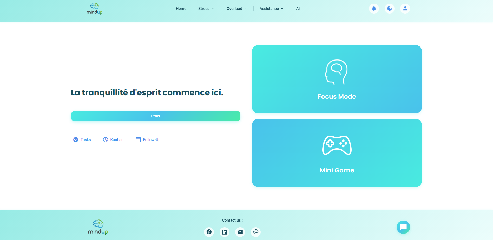

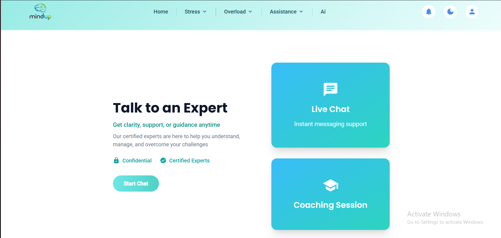

### 📋 Gestion des Tâches

#### Kanban
Tableau Kanban interactif pour organiser vos tâches en colonnes (À Faire, En Cours, Terminé).

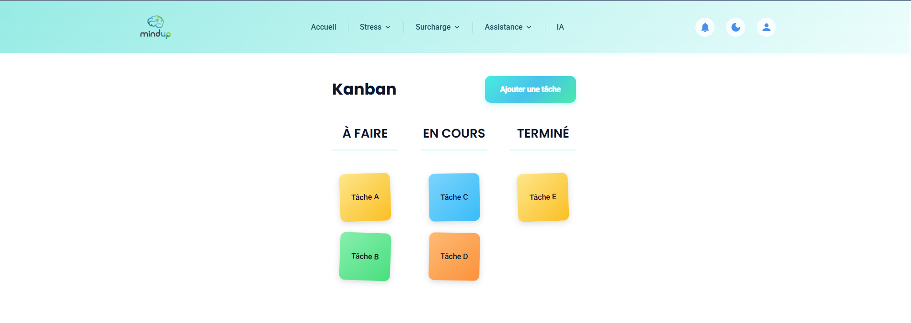

#### Tâches Quotidiennes
Gestion de vos tâches quotidiennes avec système de suivi.

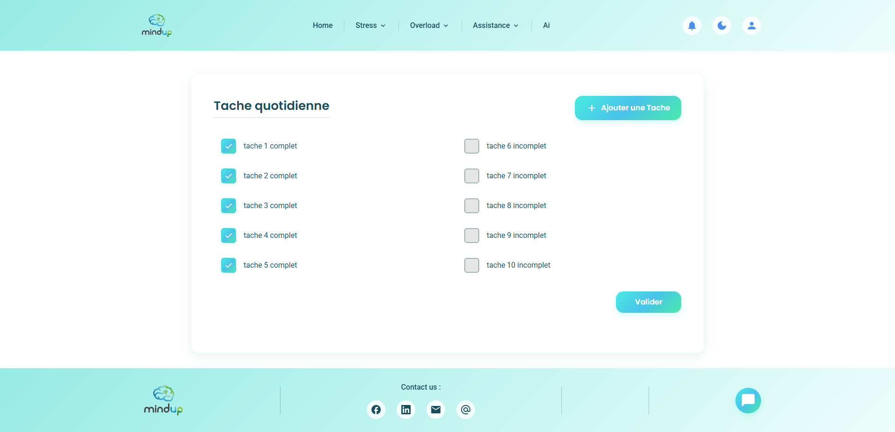

### 📅 Agenda Intelligent
Calendrier hebdomadaire pour planifier et organiser votre semaine.

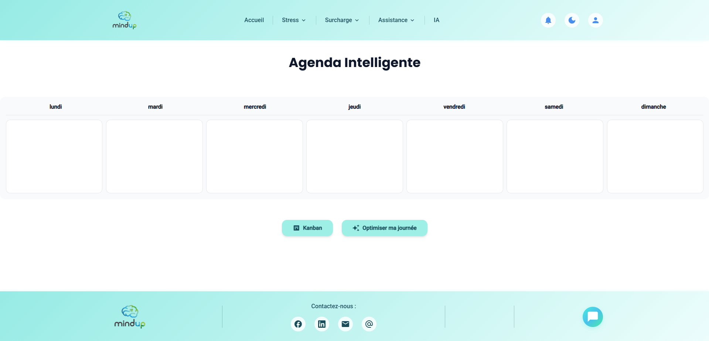

### 🎯 Mode Focus
Minuteur Pomodoro pour améliorer votre concentration et productivité.

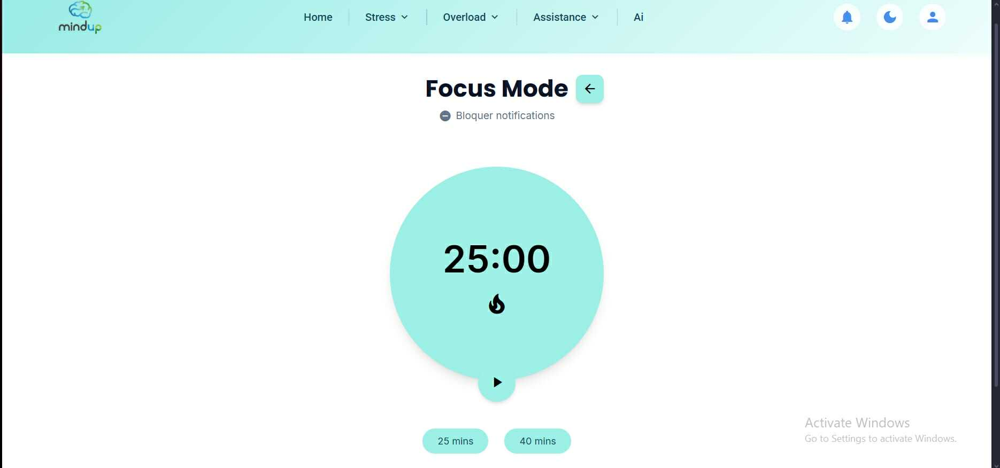

### 💬 Support et Assistance

#### Chat avec l'IA
Assistant conversationnel intelligent pour vous accompagner.

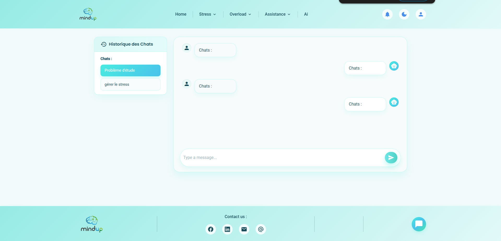

#### Discussion avec un Expert
Chat en direct avec des experts certifiés pour obtenir de l'aide professionnelle.

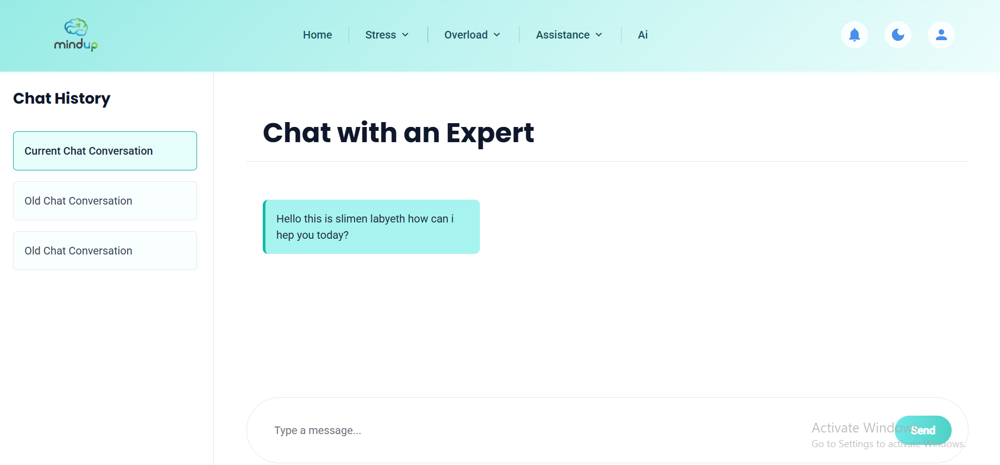

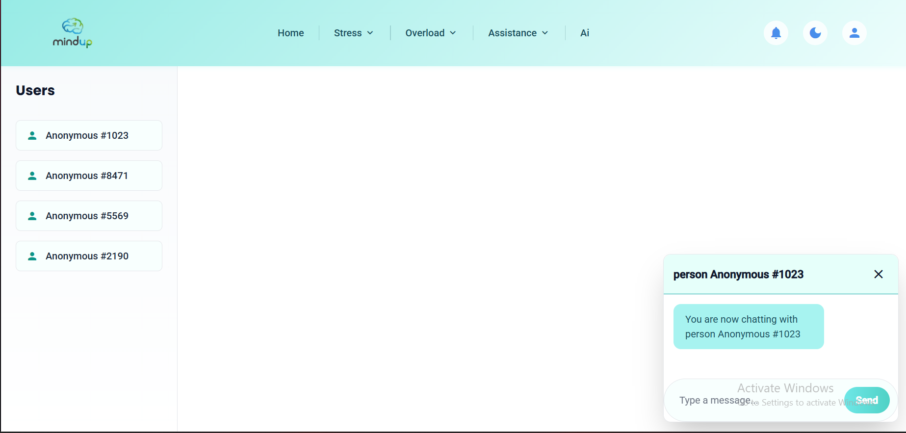

#### Soutien d'Amis
Plateforme de soutien communautaire pour échanger avec d'autres utilisateurs.

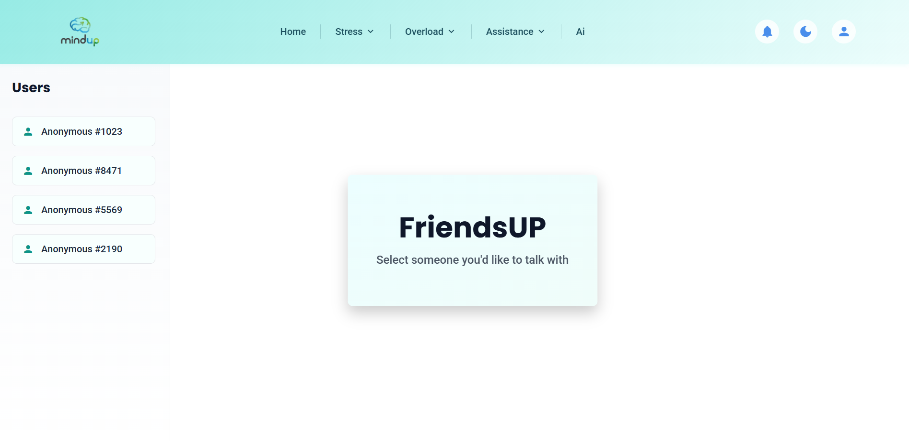

### 😊 Suivi de l'Humeur
Enregistrez et suivez votre humeur quotidienne pour mieux comprendre vos émotions.

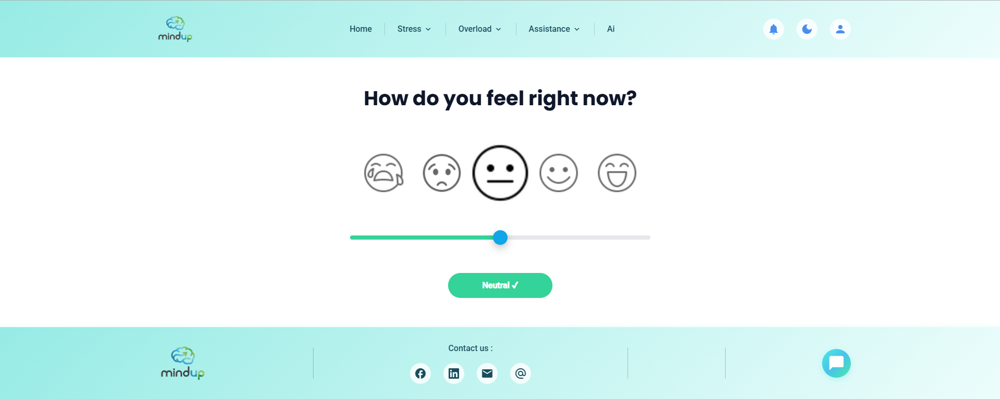

### 📊 Statistiques et Progression
Tableaux de bord détaillés pour suivre votre progression et vos statistiques.

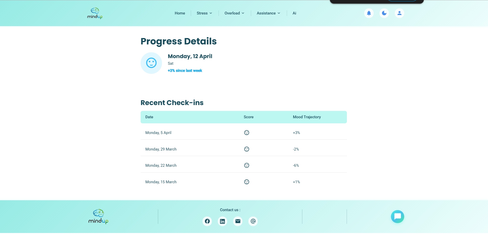

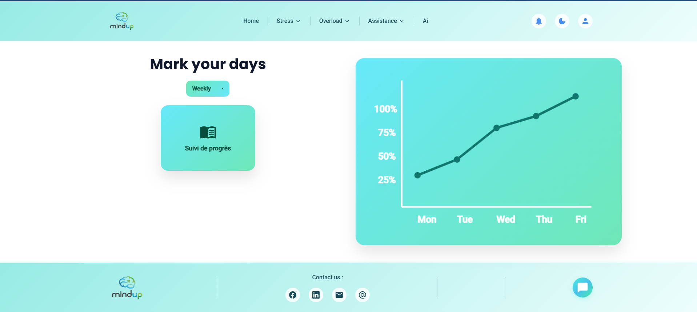

## 🛠️ Technologies Utilisées

- **HTML5** - Structure des pages
- **CSS3 / SCSS** - Styles et design responsive
- **JavaScript** - Interactivité et logique métier
- **Tailwind CSS** - Framework CSS utilitaire
- **Material Icons** - Bibliothèque d'icônes

## 📁 Structure du Projet

```
Projet/
├── index.html              # Page d'accueil
├── kanban.html            # Tableau Kanban
├── daily-task.html        # Tâches quotidiennes
├── agenda.html            # Agenda intelligent
├── focusmode.html         # Mode Focus (Pomodoro)
├── chat.html              # Chat avec l'IA
├── ExpertConvo.html       # Discussion avec expert
├── ExpertAccu.html        # Page d'accueil expert
├── FriendSup.html         # Soutien d'amis
├── mood.html              # Suivi de l'humeur
├── progress.html          # Page de progression
├── progress_details.html  # Détails de progression
├── header.html            # En-tête partagé
├── footer.html            # Pied de page partagé
├── components.js          # Chargement des composants
├── style.css              # CSS compilé
├── scss/                  # Fichiers SCSS sources
│   ├── style.scss         # Fichier principal
│   ├── _variables.scss    # Variables
│   ├── _header.scss       # Styles header
│   ├── _footer.scss       # Styles footer
│   ├── _responsive.scss   # Media queries
│   └── pages/             # Styles spécifiques aux pages
├── images/                # Images et ressources
└── Screenshot/            # Captures d'écran de l'application
```

## 🚀 Installation et Utilisation

### Prérequis
- Un serveur web local (ex: Live Server, XAMPP, ou serveur Python)
- Navigateur web moderne (Chrome, Firefox, Edge, Safari)

### Installation

1. Clonez ou téléchargez le projet
2. Ouvrez le dossier dans votre éditeur de code
3. Installez les dépendances (si nécessaire) :
   ```bash
   npm install -g sass
   ```

### Compilation SCSS

Pour compiler les fichiers SCSS en CSS :

```bash
sass scss/style.scss style.css
```

Ou en mode watch (recompilation automatique) :

```bash
sass --watch scss/style.scss:style.css
```

### Lancement

1. Ouvrez `index.html` dans votre navigateur
2. Ou utilisez un serveur local :
   ```bash
   # Avec Python
   python -m http.server 8000
   
   # Avec Node.js (http-server)
   npx http-server
   ```

## 📱 Responsive Design

L'application est entièrement responsive et s'adapte à tous les types d'écrans :
- **Desktop** : Navigation complète avec menu déroulant
- **Tablette** : Layout adapté avec sidebar
- **Mobile** : Menu hamburger avec sidebar latérale

## 🎨 Design System

L'application utilise un design system cohérent basé sur Material Design avec :
- **Couleurs principales** : Teal, Cyan, Mint
- **Typographie** : Poppins (titres), Roboto (corps)
- **Composants** : Boutons, cartes, formulaires stylisés
- **Animations** : Transitions fluides et effets hover

## 🔧 Fonctionnalités Techniques

- **Composants réutilisables** : Header et Footer chargés dynamiquement
- **Navigation responsive** : Menu burger sur mobile
- **SCSS modulaire** : Organisation par composants et pages
- **Variables CSS** : Système de couleurs et espacements centralisés

## 📝 Notes

- Tous les textes sont en français
- L'application utilise des composants partagés pour maintenir la cohérence
- Les styles sont organisés de manière modulaire pour faciliter la maintenance

## 📄 Licence

Ce projet est développé dans le cadre d'un projet académique.

---

**Développé avec ❤️ par l'équipe MindUp**
